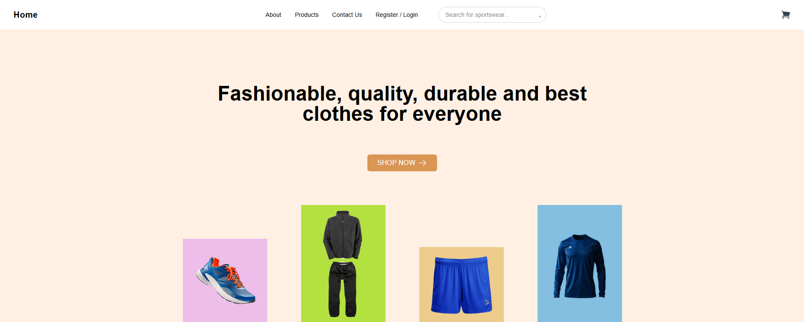
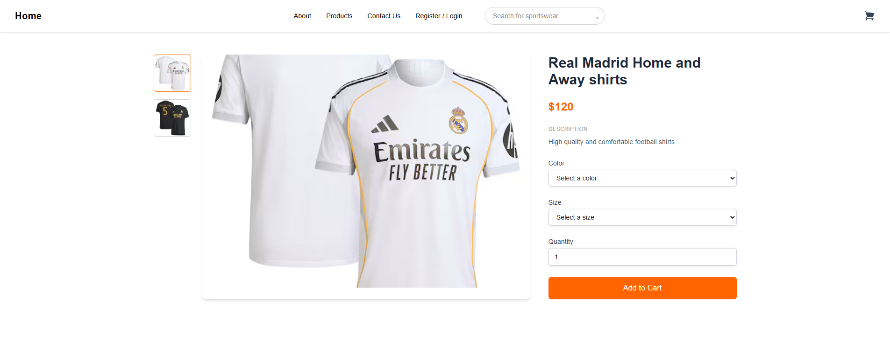
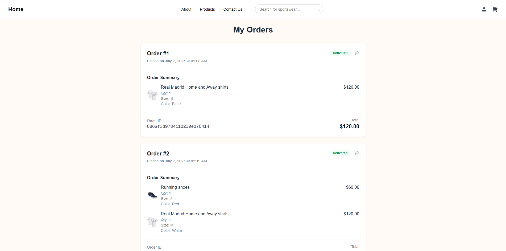

# E-Commerce Project

A full-stack e-commerce application built with Next.js, Node.js, and Express, featuring a modern user interface, MongoDB database, and robust backend services. Includes an admin side for managing products, orders, and customer messages.

## 🚀 Live Demo

Experience the live application here:  
👉 [https://e-commerce-project-rouge-sigma.vercel.app](https://e-commerce-project-rouge-sigma.vercel.app)

## 🛠️ Technologies Used

   

- **Frontend:** Next.js, CSS  
- **Backend:** Node.js, Express  
- **Database:** MongoDB  
- **Authentication:** JWT  
- **Deployment:** Vercel (Frontend), Render (Backend)

## 📦 Features

- User authentication and authorization  
- Product browsing and search  
- Shopping cart and checkout functionality  
- Admin side: create products, handle customer orders, handle messages from Contact Us page  

## 🖼️ Screenshots

|  |  |  |
|:---:|:---:|:---:|
